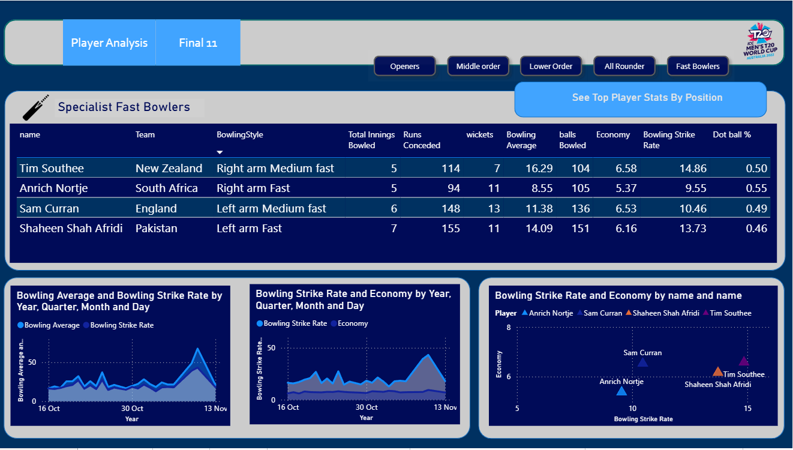
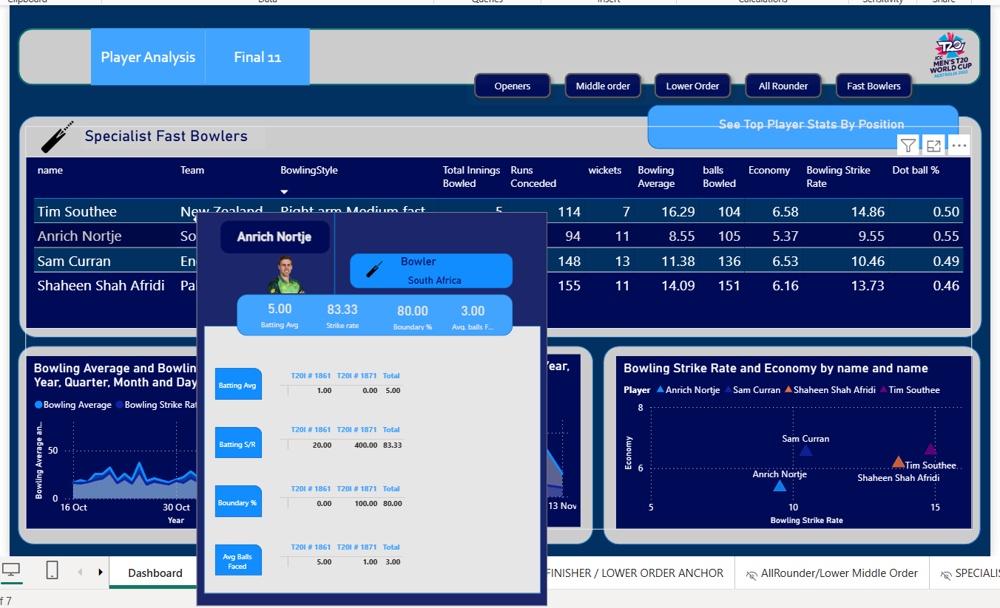
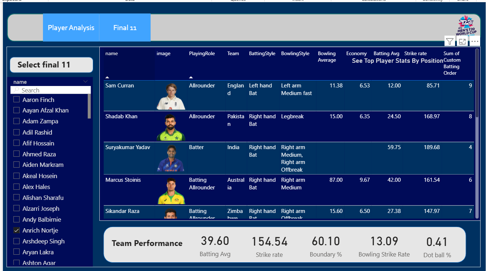

# 🏏 T20 World Cup 2022 – Data Analytics Dashboard

An **end-to-end data analytics project** built on **T20 World Cup 2022 cricket data**, showcasing skills in data collection, transformation, and visualization.  
This project demonstrates how to turn raw sports data into meaningful insights for selecting the **best playing XI** based on performance metrics.

---

## 📌 Project Overview
- Collected player and match statistics from **ESPNCricInfo** using **Bright Data web scraping**.
- Cleaned and transformed raw data with **Python (pandas, numpy)**.
- Built an **interactive Power BI dashboard** with custom tooltips and visuals for player comparison.
- Designed role-based filters to evaluate **batters, all-rounders, and bowlers** for an ideal team selection.
- Delivered a full **data pipeline → insights → visualization** workflow suitable for real-world analytics problems.

---

## 📊 Features
- **Custom Tooltip Cards** – Detailed player stats (Batting Avg, Strike Rate, Boundary %).
- **Role-Based Filtering** – Segment players as Power Hitters, Anchors, Finishers, All-Rounders, and Bowlers.
- **Performance Visuals** – Scatter plots (Avg vs Strike Rate), match-wise trend charts, and contribution analysis.
- **End-to-End Pipeline** – From web scraping → cleaning → analytics → visualization.

---

## 🛠️ Tech Stack
- **Python** – pandas, numpy (data cleaning & transformation)
- **Bright Data** – Web scraping
- **Power BI** – Dashboard & data visualization
- **GitHub** – Project hosting and documentation

---

## 📂 Project Files
- `data/raw/` → Raw scraped data (CSV/JSON format).
- `data/clean/` → Processed datasets ready for visualization.
- `Dashboard.pbix` → Power BI interactive dashboard file.
- `notebooks/` → Jupyter notebooks for cleaning and preprocessing.
- `screenshots/` → Dashboard screenshots.

---

## 📸 Screenshots

### Dashboard Overview


### Tooltip Player Card


### Final 11 Card


---

## 🚀 How to Use
1. Clone this repository:
   ```bash
   git clone https://github.com/yourusername/cricket-performance-dashboard.git
